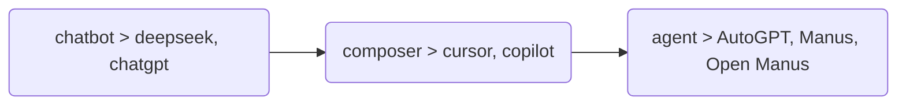
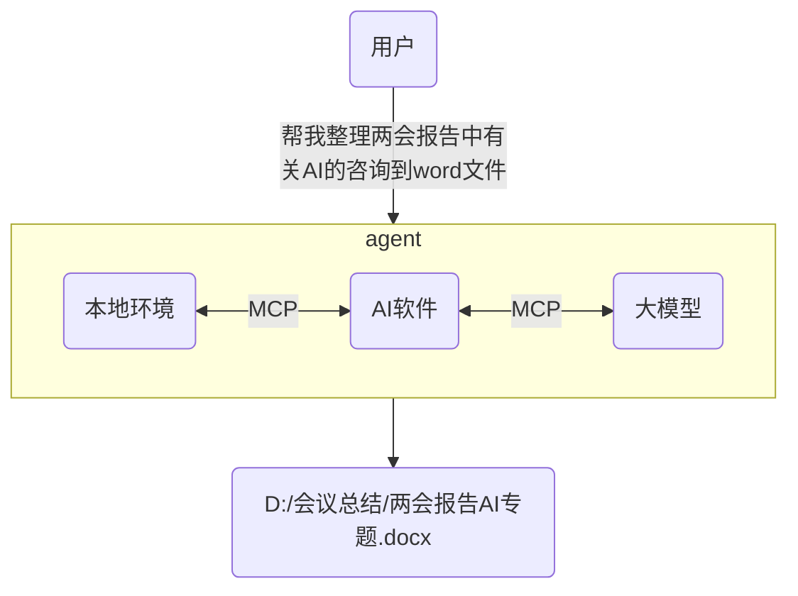
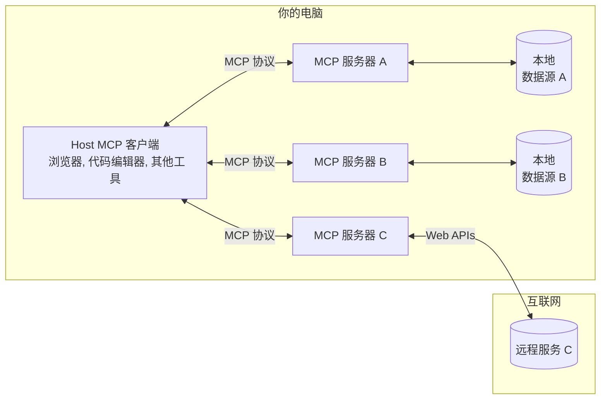
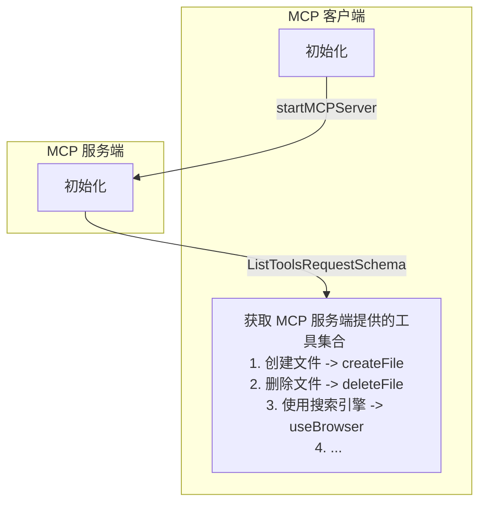
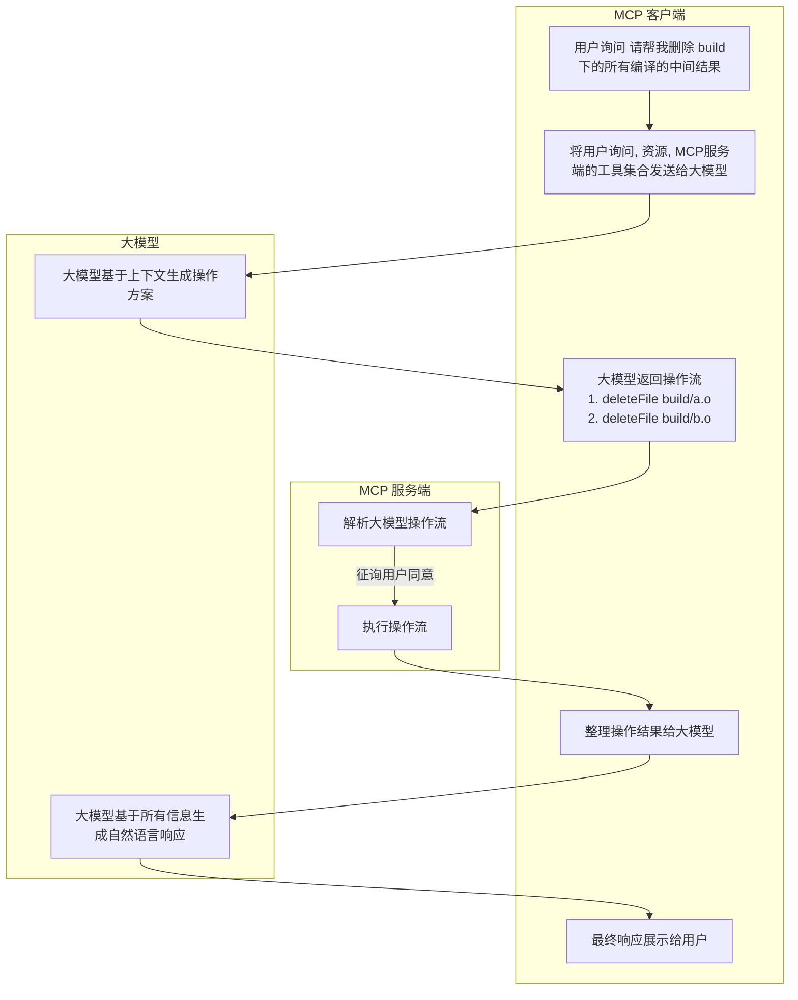

# 什么是 MCP？

MCP (Model Context Protocol)是一种开放协议，用于标准化应用程序如何向大型语言模型（LLMs）提供上下文。可以将 MCP 想象为 AI 应用的 typec 接口。正如 typec 提供了一种标准化的方式将您的设备连接到各种外设和配件，MCP 也提供了一种标准化的方式，将 AI 模型连接到不同的数据源和工具。

MCP 协议由 Anthropic 在 2024 年 11 月底推出：

- 官方文档：[Introduction](https://modelcontextprotocol.io/introduction)
- GitHub 仓库：[github.com/modelcontextprotocol](https://github.com/modelcontextprotocol)

## 为什么需要 MCP？

我们都知道，从最初的 chatgpt，到后来的 cursor，copilot chatroom，再到现在耳熟能详的 agent，实际上，从用户交互的角度去观察，你会发现目前的大模型产品经历了如下的变化：

- chatbot
    - 只会聊天的程序。
    - 工作流程：你输入问题，它给你这个问题的解决方案，但是具体执行还需要你自己去。
    - 代表工作：deepseek，chatgpt
- composer
    - 稍微会帮你干活的实习生，仅限于写代码。
    - 工作流程：你输入问题，它会给你帮你生成解决问题的代码，并且自动填入代码编辑器的编译区，你只需要审核确认即可。
    - 代表工作：cursor，copilot
- agent
    - 私人秘书。
    - 工作流程：你输入问题，它生成这个问题的解决方案，并在征询了你的同意后全自动执行。
    - 代表工作：AutoGPT，Manus，Open Manus

为了实现 agent，也就需要让 LLM 可以自如灵活地操作所有软件甚至物理世界的机器人，于是需要定义统一的上下文协议与之上统一工作流。MCP(model context protocol) 就是解决这套方案的应运而生的基础协议。一个感性认识如下：

:::info

Anthropic 对于 MCP 的必要性给出的解释：MCP 帮助您在 LLMs 之上构建 agent 和复杂的工作流程。LLMs 经常需要与数据和工具集成，而 MCP 提供了以下支持：

- 一系列不断增长的预构建集成，您的 LLM 可以直接接入这些集成。
- 在 LLM 提供商和供应商之间灵活切换。
- 在基础设施内保护数据的最佳实践。

:::

## 总体架构

MCP 的核心采用客户端-服务器架构，其中 host 可以连接到多个服务器：

- MCP 主机（MCP Hosts） ：MCP 主机是指希望通过 MCP 访问数据的程序，例如 Claude Desktop、集成开发环境（IDEs）或其他 AI 工具。
- MCP 客户端（MCP Clients）：MCP 客户端是与服务器保持 1:1 连接的协议客户端，负责与 MCP 服务器通信。
- MCP 服务器（MCP Servers）：MCP 服务器是轻量级程序，每个服务器通过标准化的 Model Context Protocol 暴露特定的功能。
- 本地数据源（Local Data Sources）：本地数据源是指 MCP 服务器可以安全访问的计算机文件、数据库和服务。
- 远程服务（Remote Services）：远程服务是指 MCP 服务器可以通过互联网连接的外部系统（例如通过 API 访问的服务）。

## MCP 的工作流程

从工作流程上，MCP 和 LSP 非常非常像，事实上，目前的 MCP 和 LSP 一样，也是基于 [JSON-RPC 2.0](https://link.zhihu.com/?target=https%3A//www.jsonrpc.org/specification) 进行数据传输的（基于Stdio 或者 基于SSE）。如果开发过 LSP 的朋友对于 MCP 应该会感到非常的理所当然。我将用若干个简单明了的泳道图尽可能让大家看懂这玩意儿是如何执行的。

### 初始化

假设我们的软件已经支持了 MCP 客户端，那么当我们的软件启动时，它会经历如下的步骤：

### 工作流程

 假设，你是一位 C语言工程师，你现在想要让 agent 自动完成一个项目的编译，那么执行流程如下：

## 开源生态

和 LSP 一样，LSP 在开源社区有非常多的客户端和服务端框架，MCP 也是一样的，目前 Anthropic 开源了一套 MCP 的服务端框架：https://github.com/modelcontextprotocol/servers ，想要探索大模型效用的朋友可以尽情去使用这个框架。这个仓库还收录了很多的官方认可的 MCP 服务器，可以作为学习的参考。

除此之外，pulsemcp 上也有很多开源社区开发的 MCP 客户端和服务端：https://www.pulsemcp.com/clients