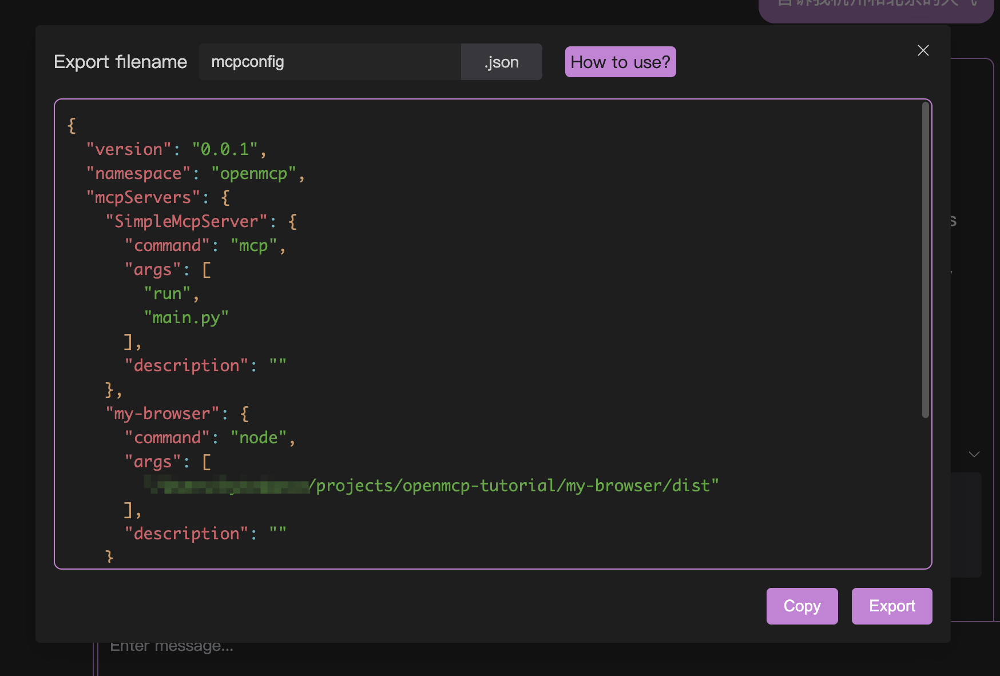

# 极速部署

openmcp-sdk 的核心特性之一就是极速部署，利用和 openmcp-client 的联动性，您可以在短短10秒内闪电般完成 MCP Agent 的部署。

## 1. 从 openmcp 中导出 mcpconfig.json

首先，先在 openmcp 中打开你调试好的 mcp 项目。假设在交互测试中，你已经完成了让您满意的调试结果。

此时，点击对话框工具栏的最右侧一个小火箭一样的图标，你会看到这样的窗口:



点击复制或者导出都可以获得一份 mcpconfig.json 文件。

## 2. 部署到 openmcp-sdk 中

然后我们创建文件 main.ts，直接简单几行代码就能把上面的配置部署成一个 agent：

```typescript
import { OmAgent } from 'openmcp-sdk/service/sdk';

const agent = new OmAgent();
agent.loadMcpConfig('./mcpconfig.json');  
const res = await agent.ainvoke({ messages: '今天杭州的天气是什么样子的？' });

console.log('⚙️ Agent Response', res);
```


使用 `npx tsx main.ts` 运行一下，得到如下结果：

```
[2025/6/22 19:05:08] 🚀 [SimpleMcpServer] 1.9.2 connected
[2025/6/22 19:05:11] 🤖 Agent wants to use these tools weather
[2025/6/22 19:05:11] 🔧 using tool weather
[2025/6/22 19:05:11] ✓  use tools success
⚙️ Agent Response 今天杭州的天气是小雨，气温为24.7°C，湿度为95%，空气质量指数（AQI）为26，空气质量良好。
```
