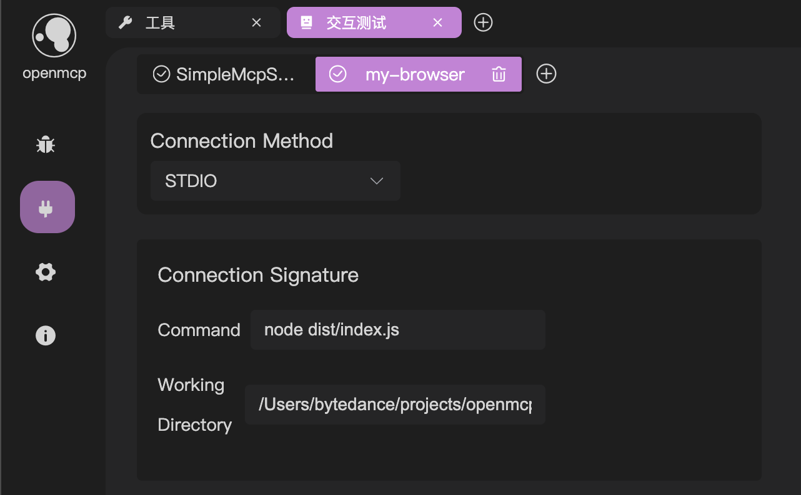

# 连接多个 MCP 服务器

openmcp-sdk 提供了两种方法，让您可以在一个 agent 上同时连接多个 mcp 服务器。

## 方法一：mcpconfig.json (推荐)

在 openmcp 插件中，你可以通过下面的面板连接多个 mcp 服务器并进行测试



这个时候你再去根据 [极速部署](./fast-deploy.md) 中的指示导出后，sdk 就会自动帮你连接这多个服务器了。

## 方法二：addMcpServer

您也可以通过下面的代码，在 agent 中添加多个 mcp 服务器：

```typescript
agent.addMcpServer({
    connectionType: 'STDIO',
    commandString: 'uv run main.py',
    cwd: '/path/to/workspace',
});

agent.addMcpServer({
    connectionType: 'STREAMABLE_HTTP',
    url: 'go run /path/to/main.go',
});
```